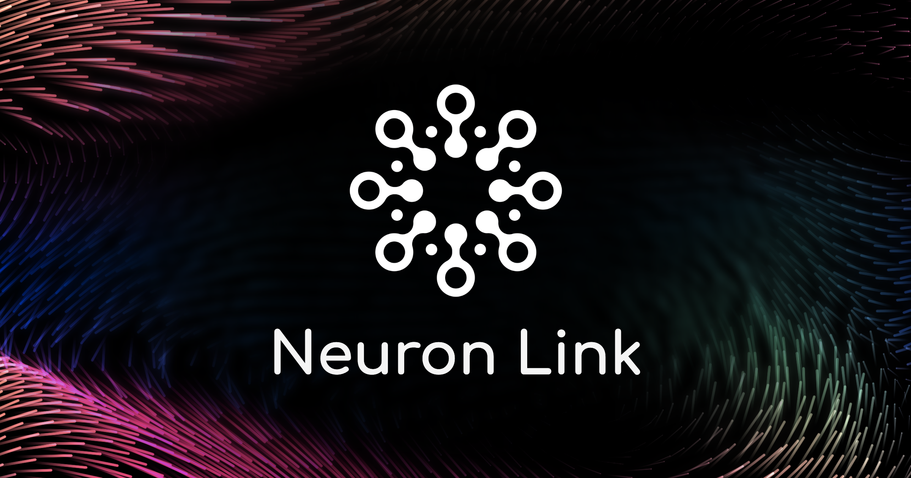

<div align="center">
  
</div>

<div align="center">
  <h2>Join the Neuron Link or Neuron Link code agent, Neuron Link CA Community</h2>
  <p>Connect with developers, contribute ideas, and stay ahead with the latest AI-powered coding tools.</p>
  
  <a href="https://discord.gg/neuronlink" target="_blank"></a>
  
</div>

<div align="center">
<h1>Neuron Link Code Agent</h1>

<a href="https://marketplace.visualstudio.com/items?itemName=NeuronLink.NeuronLink-CA" target="_blank"></a>
<a href="https://github.com/NeuronLinkAI/NeuronLink-CA/issues" target="_blank"></a>
<a href="https://marketplace.visualstudio.com/items?itemName=NeuronLink.NeuronLink-CA&ssr=false#review-details" target="_blank"></a>

</div>

**Neuron Link** is an AI-powered **autonomous coding agent** that lives in your editor. It can:

- Communicate in natural language
- Read and write files directly in your workspace
- Run terminal commands
- Automate browser actions
- Integrate with any OpenAI-compatible or custom API/model
- Adapt its “personality” and capabilities through **Custom Modes**

Whether you’re seeking a flexible coding partner, a system architect, or specialized roles like a QA engineer or product manager, Neuron Link or Neuron Link code agent, Neuron Link CA can help you build software more efficiently.

Check out the [CHANGELOG](CHANGELOG.md) for detailed updates and fixes.

## Installation

Neuron Link or Neuron Link code agent, Neuron Link CA is available on:

- **[VSCode Marketplace](https://marketplace.visualstudio.com/items?itemName=NeuronLink.NeuronLink-CA)**
- **[Open-VSX](https://open-vsx.org/extension/NeuronLink/NeuronLink-CA)**

1. **Search “Neuron Link”** in your editor’s Extensions panel to install directly.
2. Or grab the `.vsix` file from Marketplace / Open-VSX and **drag-and-drop** into your editor.
3. **Open** Neuron Link from the Activity Bar or Command Palette to start chatting.

> **Tip**: Use `Cmd/Ctrl + Shift + P` → “Neuron Link or Neuron Link code agent, Neuron Link CA: Open in New Tab” to dock the AI assistant alongside your file explorer.

---

## Local Setup & Development

1. **Clone** the repo:
    ```bash
    git clone https://github.com/NeuronLinkAI/NeuronLink-CA.git
    ```
2. **Install dependencies**:
    ```bash
    npm run install:all
    ```
3. **Build** the extension:
    ```bash
    npm run build
    ```
    - A `.vsix` file will appear in the `bin/` directory.
4. **Install** the `.vsix` manually if desired:
    ```bash
    code --install-extension bin/neuronlink-1.0.0.vsix
    ```
5. **Start the webview (Vite/React app with HMR)**:
    ```bash
    npm run dev
    ```
6. **Debug**:
    - Press `F5` (or **Run** → **Start Debugging**) in VSCode to open a new session with Neuron Link.

Changes to the webview will appear immediately. Changes to the core extension will require a restart of the extension host.

We use [changesets](https://github.com/changesets/changesets) for versioning and publishing. Check our `CHANGELOG.md` for release notes.

---

## Contributing

We love community contributions! Here’s how to get involved:

1. **Check Issues & Requests**: See [open issues](https://github.com/NeuronLinkAI/NeuronLink-CA/issues) or [feature requests](https://github.com/NeuronLinkAI/NeuronLink-CA/discussions/categories/feature-requests).
2. **Fork & branch** off `main`.
3. **Submit a Pull Request** once your feature or fix is ready.
4. **Join** our [Discord](https://discord.gg/neuronlink) for feedback, tips, and announcements.

---

## License

[Apache 2.0 © 2025 Neuron Link Labs.](./LICENSE)

---

**Enjoy Neuron Link** Whether you keep it on a short leash or let it roam autonomously, we can’t wait to see what you build. If you have questions or feature ideas, drop by our [Discord](https://discord.gg/neuronlink). Happy coding!
